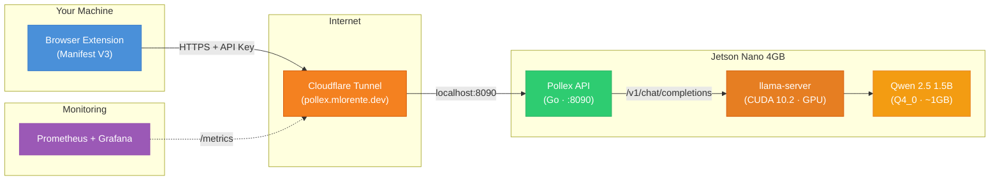
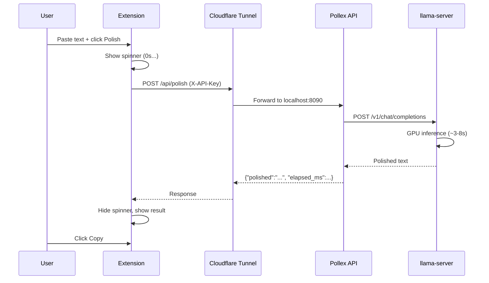

# Pollex

**Polish your English text** — fixes grammar, improves coherence, and tightens wording. The output sounds like a fluent non-native speaker: professional and clear, not AI-generated.

Self-hosted, private, and fast. Runs entirely on a Jetson Nano 4GB with GPU inference via llama.cpp.

## Architecture



| Layer | Tech | Role |
|-------|------|------|
| Extension | Chrome Manifest V3 | UI — paste text, select model, copy result |
| Tunnel | Cloudflare Tunnel | Zero-config ingress (Jetson behind double NAT) |
| API | Go 1.26, stdlib `net/http` | Routes text to LLM backends, returns polished result |
| LLM | llama.cpp + Qwen 2.5 1.5B Q4_0 | Local GPU inference on Jetson Nano (~3s short, ~16s medium) |
| Monitoring | Prometheus + Alertmanager + Grafana | SLO tracking, alerting, dashboards |

## How It Works



## Quick Start

### Development (no GPU needed)

```sh
make dev    # Start API with mock adapter on :8090
make test   # Run all tests (80+ with subtests, race detector)
```

Load the extension: `chrome://extensions` → Developer mode → Load unpacked → select `extension/`.

### Benchmark

```sh
make bench       # Against local API (mock)
make bench-jetson  # Against Jetson via Cloudflare Tunnel
```

## API

| Method | Path | Auth | Description |
|--------|------|------|-------------|
| `POST` | `/api/polish` | `X-API-Key` | Polish text via selected model |
| `GET` | `/api/models` | `X-API-Key` | List available models |
| `GET` | `/api/health` | None | Health check (per-adapter status) |
| `GET` | `/metrics` | None | Prometheus metrics |

```sh
curl -X POST https://pollex.mlorente.dev/api/polish \
  -H 'Content-Type: application/json' \
  -H 'X-API-Key: YOUR_KEY' \
  -d '{"text":"i goes to store yesterday","model_id":"qwen2.5-1.5b-gpu"}'

# {"polished":"I went to the store yesterday.","model":"qwen2.5-1.5b-gpu","elapsed_ms":3200}
```

## Project Structure

```
pollex/
├── cmd/
│   ├── pollex/              # Entry point (flags, config, wiring, shutdown)
│   └── benchmark/           # Benchmark CLI tool
├── internal/
│   ├── adapter/             # LLMAdapter interface + implementations
│   │   ├── adapter.go       #   Interface: Name(), Polish(), Available()
│   │   ├── mock.go          #   Mock (dev/testing)
│   │   ├── ollama.go        #   Ollama (legacy, optional)
│   │   ├── claude.go        #   Claude API (optional)
│   │   └── llamacpp.go      #   llama.cpp (primary, GPU)
│   ├── config/              # YAML + env overrides (POLLEX_*)
│   ├── handler/             # HTTP handlers + response helpers
│   ├── middleware/           # CORS, RequestID, Logging, RateLimit, APIKey, MaxBytes
│   └── server/              # SetupMux + integration tests
├── extension/               # Chrome extension (Manifest V3)
├── prompts/polish.txt       # System prompt
├── deploy/
│   ├── loadtest/            # k6 load test scripts (normal, burst, jetson, soak)
│   ├── systemd/             # pollex-api, llama-server, cloudflared services
│   ├── scripts/             # init, build-llamacpp, setup-cloudflared
│   ├── prometheus/          # Alert rules, scrape config, alertmanager
│   ├── grafana/             # Dashboard JSON + provisioning
│   └── config.yaml          # Production config (deployed to Jetson)
├── Dockerfile               # Multi-stage: Go builder → alpine (24.7MB)
├── docker-compose.yml       # Local dev (mock mode)
├── docker-compose.monitoring.yml  # Prometheus + Alertmanager + Grafana
├── .github/workflows/       # CI (lint+test+build) + Release (goreleaser)
└── Makefile
```

## Contributing

### Prerequisites

- Go 1.26+
- Chrome (for extension testing)

### Development Workflow

1. **Run tests first** to ensure a clean baseline:
   ```sh
   make test
   make lint
   ```

2. **Start the dev server** with the mock adapter (no LLM needed):
   ```sh
   make dev
   ```

3. **Load the extension** in Chrome (`chrome://extensions` → Load unpacked → `extension/`).

4. **Make changes** — the adapter pattern makes it easy to add new LLM backends:
   - Implement the `LLMAdapter` interface in `internal/adapter/`
   - Register it in `cmd/pollex/main.go:buildAdapters()`
   - The rest (routing, health checks, model listing) is automatic

5. **Run tests** before pushing:
   ```sh
   make test   # All tests with race detector
   make lint   # go vet + gofmt
   ```

### Middleware Chain

Request processing order (defined in `internal/middleware/chain.go`):

```
CORS → RequestID → Logging → Metrics → APIKey → RateLimit → MaxBytes(64KB) → Timeout(120s) → Router
```

### Hardening

| Protection | Limit | Response |
|------------|-------|----------|
| API key | `X-API-Key` header, constant-time compare | 401 |
| Request body | 64KB max | 413 |
| Text length | 10,000 chars | 400 |
| Rate limit | 10 req/min/IP (sliding window) | 429 |
| Request timeout | 120s | 504 |

### CI/CD

- **Push to `master`** or **PR** → lint + test + build (amd64 + arm64)
- **Tag `v*`** → goreleaser creates GitHub release with binaries + extension zip

Commit messages follow [Conventional Commits](https://www.conventionalcommits.org/).

## Docker

```sh
make docker-build   # Build image (alpine:3.21, ~25MB, non-root)
make docker-dev     # Run pollex in Docker (mock mode, :8090)
make docker-down    # Stop container
```

### Monitoring Stack

```sh
make dev              # Start pollex natively (mock mode)
make monitoring-up    # Start Prometheus + Alertmanager + Grafana
```

- Prometheus: [localhost:9090](http://localhost:9090) — 6 alerting rules based on SLOs
- Grafana: [localhost:3000](http://localhost:3000) — Pollex SRE Overview dashboard (auto-provisioned)
- Alertmanager: [localhost:9093](http://localhost:9093) — Slack webhook routing

```sh
make monitoring-down      # Stop monitoring stack
make monitoring-validate  # Validate Prometheus rules syntax
```

## Deploy to Jetson

### First-time setup

```sh
make deploy-init      # Packages, CUDA PATH, /etc/pollex, systemd services
make deploy-llamacpp  # Build llama.cpp with CUDA on Jetson (~85 min)
make deploy           # Binary + config + prompt
make deploy-secrets   # API key
make deploy-tunnel    # Cloudflare Tunnel
```

### Subsequent deploys

```sh
make deploy           # Build ARM64 + SCP + restart service
```

### Remote operations

```sh
make jetson-status          # Health check via SSH
make jetson-test            # End-to-end polish test
make jetson-logs            # Tail API logs
make jetson-tunnel-status   # Tunnel health
```

## Hardware

**Jetson Nano 4GB** — ARM64, CUDA 10.2, 128 Maxwell cores.

| Component | RAM |
|-----------|-----|
| JetPack OS (headless) | ~500MB |
| llama-server (GPU) | ~200MB |
| Qwen 2.5 1.5B (Q4) | ~1.0GB |
| Pollex API | ~15MB |
| **Free** | **~2.3GB** |

## License

[MIT](LICENSE)
