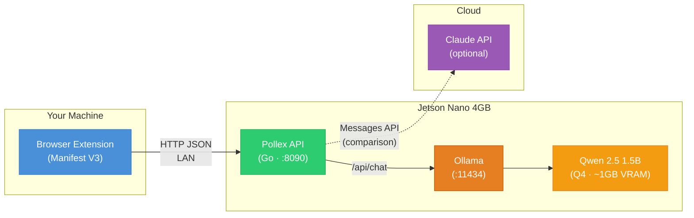
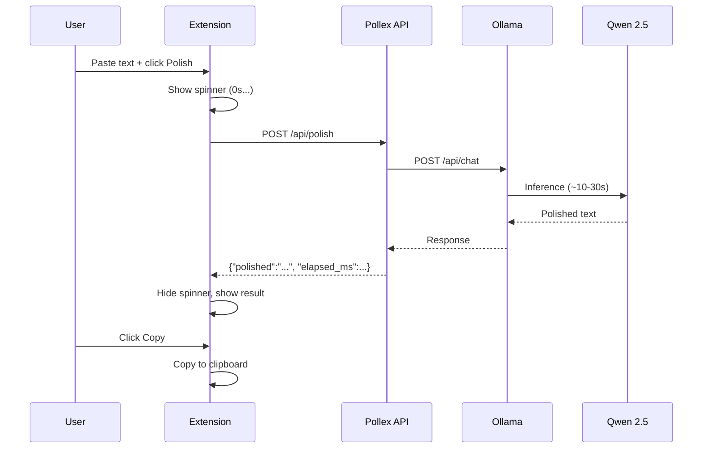

# Pollex

**Polish your English text** — fixes grammar, syntax, and coherence. The output sounds like a fluent non-native speaker: professional and clear, not AI-generated.

## Architecture



**Three layers, zero complexity:**

| Layer | Tech | Role |
|-------|------|------|
| Extension | Manifest V3 | Pure UI — no API keys, no logic |
| API | Go 1.26, stdlib `net/http` | Routes text to LLM backends, returns polished result |
| LLM | Ollama + Qwen 2.5 1.5B | Local inference on Jetson Nano (Claude API optional) |

## How It Works



## Quick Start

### Development (Docker)

```sh
make ollama-up      # Start Ollama in Docker + pull model (~1GB)
make dev-ollama     # Start API connected to Ollama on :8090
```

Then load the extension in Chrome: `chrome://extensions` → Developer mode → Load unpacked → select `extension/`.

### Development (Mock)

```sh
make dev            # Start API with mock adapter (no LLM needed)
```

### Run Tests

```sh
make test           # 33 tests with race detector
make lint           # go vet + gofmt
```

## API

| Method | Path | Description |
|--------|------|-------------|
| `POST` | `/api/polish` | Polish text via selected model |
| `GET` | `/api/models` | List available models |
| `GET` | `/api/health` | Health check |

**Example:**

```sh
curl -X POST http://localhost:8090/api/polish \
  -H 'Content-Type: application/json' \
  -d '{"text":"i goes to store yesterday","model_id":"qwen2.5:1.5b"}'

# {"polished":"I went to the store yesterday.","model":"qwen2.5:1.5b","elapsed_ms":4830}
```

## Project Structure

```
pollex/
├── backend/              # Go API (package main, ~700 lines)
│   ├── main.go           # Entry point, wiring, --mock flag
│   ├── config.go         # YAML config + env var overrides
│   ├── adapter.go        # LLMAdapter interface
│   ├── adapter_mock.go   # Mock adapter for development
│   ├── adapter_ollama.go # Ollama (local LLM)
│   ├── adapter_claude.go # Claude API (optional)
│   ├── handler_*.go      # HTTP handlers
│   ├── middleware.go      # CORS, logging, timeout
│   └── *_test.go         # Table-driven tests
├── extension/            # Browser extension (Manifest V3)
│   ├── popup.*           # Main UI
│   ├── settings.*        # API URL configuration
│   └── api.js            # HTTP client
├── prompts/
│   └── polish.txt        # System prompt (9 rules)
├── deploy/               # systemd, install scripts
└── Makefile              # All targets
```

## Hardware Target

**Jetson Nano 4GB** — ARM64, CUDA 10.2, 128 Maxwell cores.

| Component | RAM |
|-----------|-----|
| JetPack OS (headless) | ~500MB |
| Ollama runtime | ~200MB |
| Qwen 2.5 1.5B (Q4) | ~1.0GB |
| Pollex API | ~15MB |
| **Free** | **~2.3GB** |

## Deploy to Jetson

```sh
make deploy-setup   # First time: install Ollama + systemd service
make deploy         # Build ARM64 binary + SCP + restart service
make jetson-status  # Remote health check
```

## Makefile Targets

```sh
make help
```

| Target | Description |
|--------|-------------|
| `dev` | Start API with mock adapter |
| `dev-ollama` | Start API with local Ollama |
| `test` | Run all tests with race detector |
| `lint` | go vet + gofmt |
| `ollama-up` | Start Ollama in Docker |
| `ollama-down` | Stop Ollama container |
| `build` | Build for current platform |
| `build-arm64` | Cross-compile for Jetson |
| `deploy` | Deploy to Jetson |
| `deploy-setup` | First-time Jetson setup |

## License

[MIT](LICENSE)
