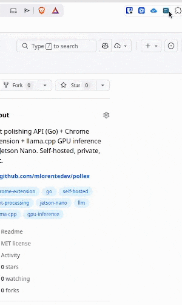
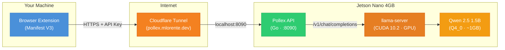

# Pollex

**Polish your English text** — fixes grammar, improves coherence, and tightens wording. The output sounds like a fluent non-native speaker: professional and clear, not AI-generated.

Self-hosted, private, and fast. Runs on a Jetson Nano 4GB with GPU inference via llama.cpp. Optional cloud fallback via [nan.builders](https://nan.builders).



## Quick Start

```sh
make dev    # Start API with mock adapter on :8090
make test   # Run all tests (80+, race detector)
```

Load the extension: `chrome://extensions` → Developer mode → Load unpacked → `extension/`.

## Architecture


```mermaid
graph LR
    subgraph Your Machine
        EXT["Browser Extension<br/>(Manifest V3)"]
    end

    subgraph Internet
        CF["Cloudflare Tunnel<br/>(pollex.mlorente.dev)"]
    end

    subgraph Jetson Nano 4GB
        API["Pollex API<br/>(Go · :8090)"]
        LLAMA["llama-server<br/>(CUDA 10.2 · GPU)"]
        MODEL["Qwen 2.5 1.5B<br/>(Q4_0 · ~1GB)"]
    end

    EXT -- "HTTPS + API Key" --> CF
    CF -- "localhost:8090" --> API
    API -- "/v1/chat/completions" --> LLAMA
    LLAMA --> MODEL

    style EXT fill:#4a90d9,stroke:#3a7bc8,color:#fff
    style CF fill:#f48120,stroke:#d35400,color:#fff
    style API fill:#2ecc71,stroke:#27ae60,color:#fff
    style LLAMA fill:#e67e22,stroke:#d35400,color:#fff
    style MODEL fill:#f39c12,stroke:#e67e22,color:#fff
```

| Layer | Tech | Role |
| --- | --- | --- |
| Extension | Chrome Manifest V3 | Paste text, select model, copy result |
| Tunnel | Cloudflare Tunnel | Zero-config ingress (Jetson behind NAT) |
| API | Go 1.26, stdlib `net/http` | Routes text to LLM backends |
| LLM (local) | llama.cpp + Qwen 2.5 1.5B Q4_0 | GPU inference (~3s short, ~16s medium) |
| LLM (cloud) | NaN gateway (`nan.builders`) | "NaN Cloud (auto)" — failover chain `mimo-v2.5` → `qwen3.6` → `gemma4` (ADR-009) |
| Monitoring | Prometheus + Alertmanager + Grafana | SLO tracking, alerting, dashboards |

## API

| Method | Path | Auth | Description |
| --- | --- | --- | --- |
| `POST` | `/api/polish` | `X-API-Key` | Polish text via selected model |
| `GET` | `/api/models` | `X-API-Key` | List available models |
| `GET` | `/api/health` | None | Health check (per-adapter status) |
| `GET` | `/metrics` | None | Prometheus metrics |

```sh
curl -X POST https://pollex.mlorente.dev/api/polish \
  -H 'Content-Type: application/json' \
  -H 'X-API-Key: YOUR_KEY' \
  -d '{"text":"i goes to store yesterday","model_id":"qwen2.5-1.5b-gpu"}'
# {"polished":"I went to the store yesterday.","model":"qwen2.5-1.5b-gpu","elapsed_ms":3200}
```

## Deploy

```sh
make deploy-init      # First-time: packages, CUDA, systemd services
make deploy-llamacpp  # Build llama.cpp with CUDA on Jetson (~85 min)
make deploy           # Binary + config + prompt → Jetson + restart
make deploy-secrets   # API key
make deploy-tunnel    # Cloudflare Tunnel
```

See [`docs/runbooks/`](docs/runbooks/) for detailed runbooks and [`docs/adr/`](docs/adr/) for architecture decisions.

Run `make help` for all available targets.

## Contributing

1. `make test && make lint` — clean baseline
2. `make dev` — mock adapter on `:8090`
3. Add a new LLM backend: implement `LLMAdapter` in `internal/adapter/`, register in `cmd/pollex/main.go:buildAdapters()`.

Middleware chain: `CORS → RequestID → Logging → Metrics → APIKey → RateLimit → MaxBytes(64KB) → Timeout(120s) → Router`

## Documentation

Project-bound docs live in [`docs/`](docs/): ADRs, runbooks, troubleshooting, lessons, and benchmarks.

## License

[MIT](LICENSE)
