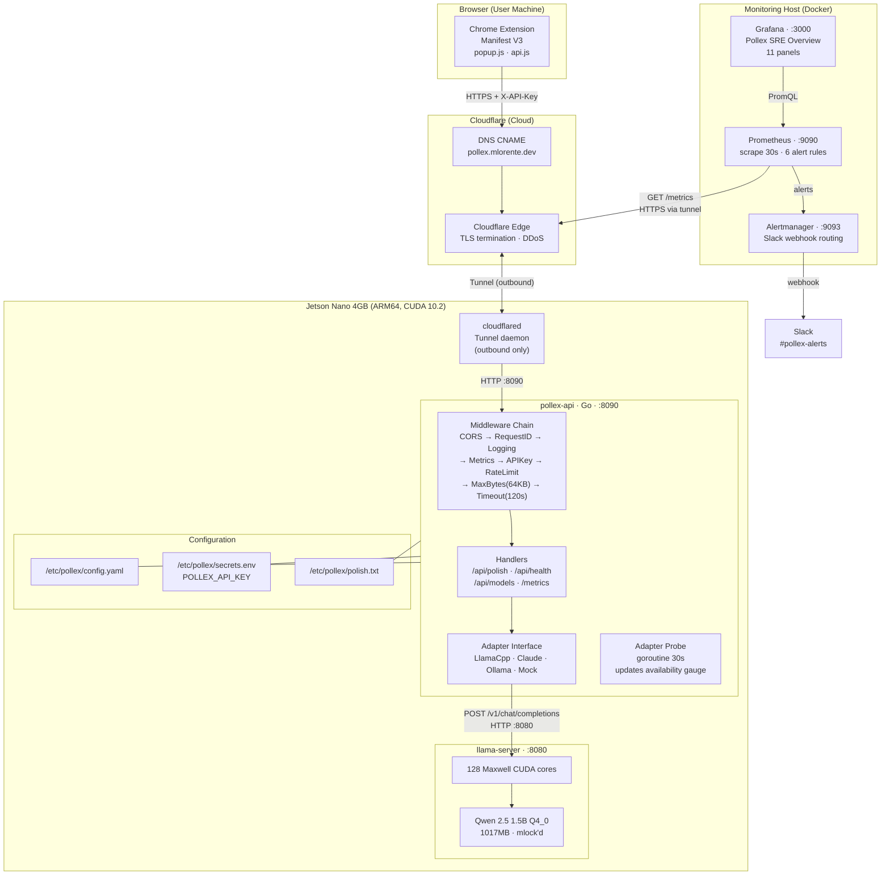
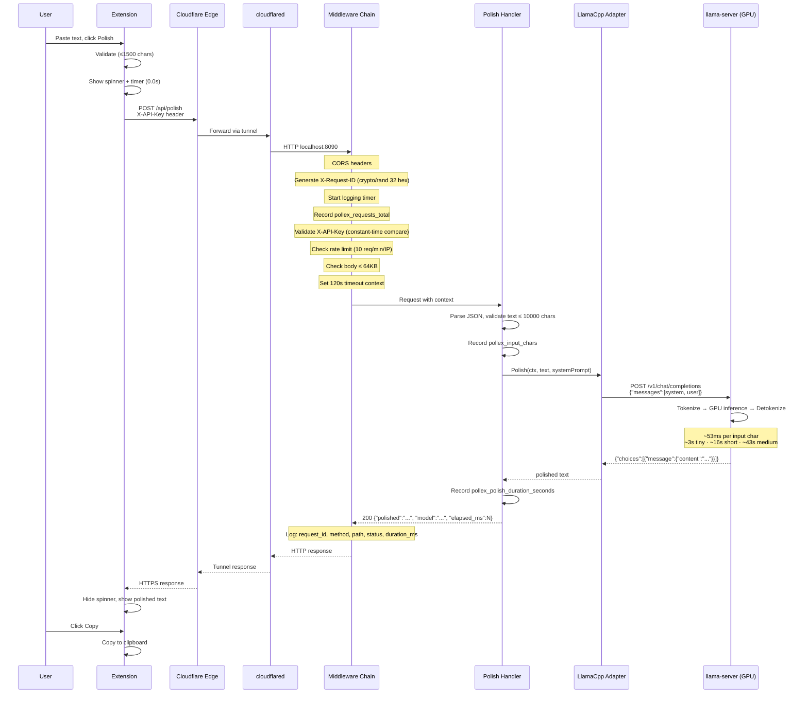
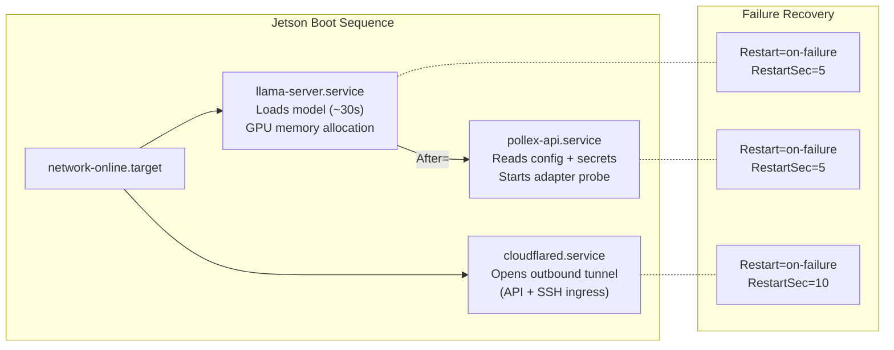
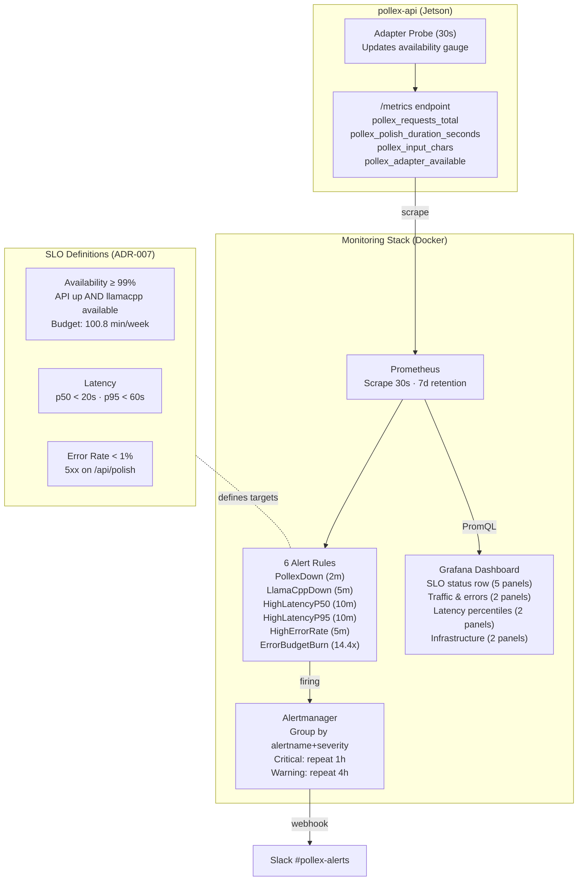
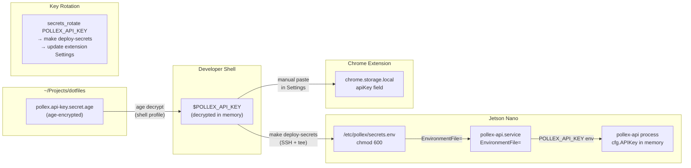

# Pollex — Architecture

## System Overview

## Request Flow (Polish)

## Service Dependencies (Systemd)

## Monitoring Architecture

## Secrets Flow

## API Endpoints

| Method | Path | Auth | Description |
|--------|------|------|-------------|
| POST | `/api/polish` | `X-API-Key` | Polish text via selected model |
| GET | `/api/models` | `X-API-Key` | List available models |
| GET | `/api/health` | None | Rich health check with per-adapter availability |
| GET | `/metrics` | None | Prometheus metrics |

## Related

- [ADR-005: Cloudflare Tunnel](../adr/005-cloudflare-tunnel-public-access.md)
- [ADR-007: SLOs and SLIs](../adr/007-slos-and-slis.md)
- [ADR-008: Multi-Node Deployment](../adr/008-multi-node-deployment.md)
- [Benchmark Baseline](../benchmarks/jetson-nano-baseline.md)
